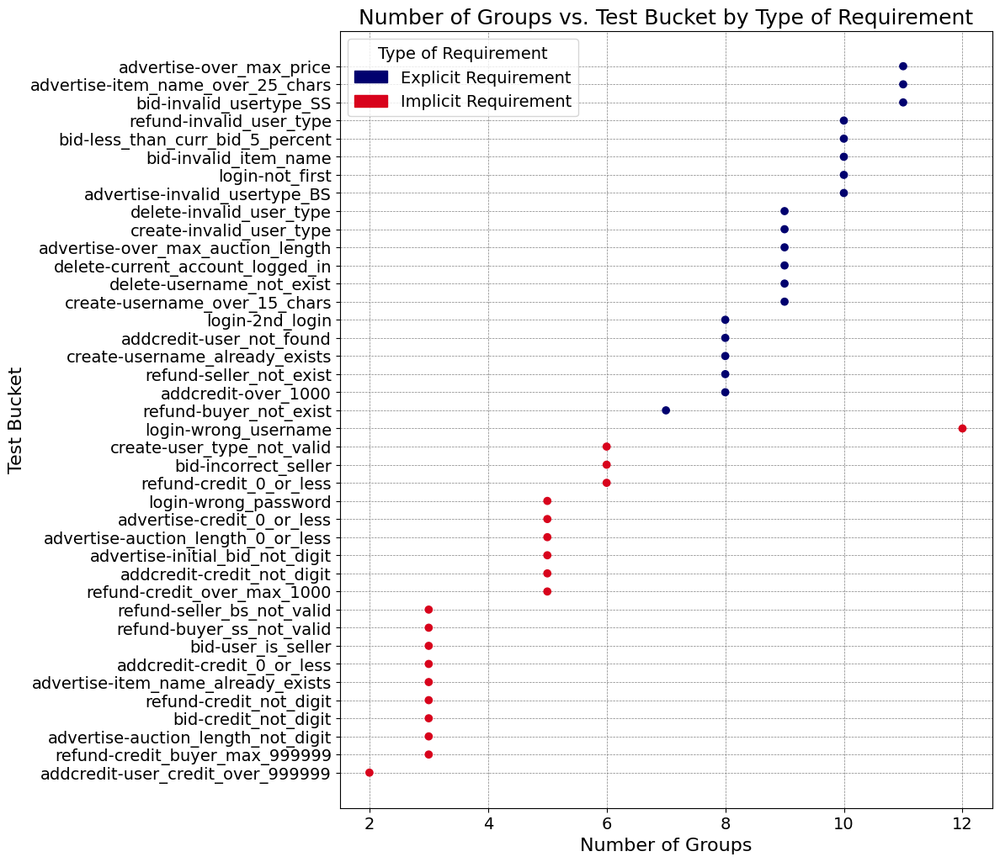
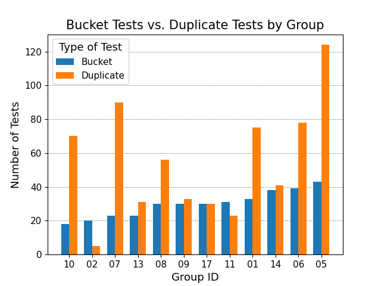
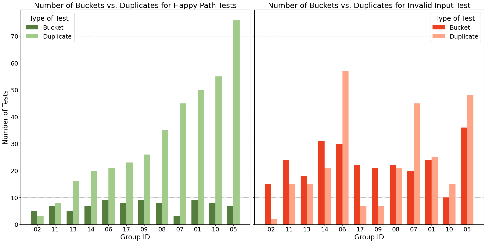
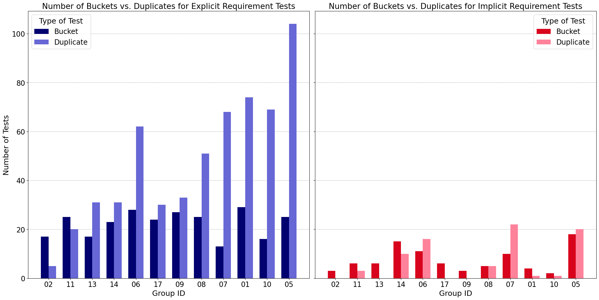

# Evaluation of Student Written Test Suites
The aim of this thesis project was to gather insights into the types of tests students test ineffectively and inefficiently.

## 2023 Results
The following are charts from the analysis of types of tests from student-written test suites.

### Chart 1: Number of Groups vs. Test Bucket by Type of Requirement
This chart shows that students are more likely to effectively test for the explicit requirement than the implicit requirements.

### Chart 2: Bucket Tests vs. Duplicate Tests by Group
This demonstrates that students inefficiently test with high redundancy/duplicates.

### Chart 3: Number of Buckets vs. Duplicates for Happy Path Tests vs. Invalid Input Tests
This illustrates that students inefficiently test for happy path and invalid input tests.

### Chart 4: Number of Buckets vs. Duplicates for Explicit Requirements vs. Implicit Requirements
The chart shows students inefficiently test for explicit requirements with a high number of duplicates. In addition, the students ineffectively test for implicit requirements with many groups missing more than half the available buckets.

